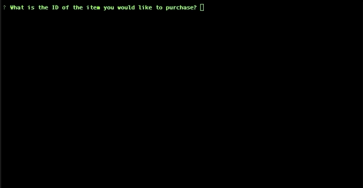

# Bamazon App

Bamazon offers you the experience of shopping online through your command line. You can use this app in customer view or manager view. Customer view allows you to shop for the items available while Manager view allows you to keep track of your stock, update inventory, and add new products.

## Getting Started

This is a CLI node application and can only be run in your terminal.

### Installing

To install all dependencies, run 

```
npm install 
```

in your terminal.


## Running the tests

Create a local database from schema provided. (add table and seeds)

make sure to update your local password for mysql in each file being ran.

To run customer view, use 
```
node bamazonCustomer.js
```

Alternatively, you can also see the manager view by running
```
node bamazonManager.js
```

## Functionality

Once you have Bamazon cloned and all the dependencies install, migrate to the app and run the following tests




### Code snippets

Customer view query example using inquirer
```javascript
function displayInventory() {
  connection.query(
    "SELECT * FROM products", function (err, res) {
      if (err) throw err;

      console.table(res);

      inquirer
        .prompt([
          {
            type: "input",
            name: "itemID",
            message: "What is the ID of the item you would like to purchase?",
          },
          {
            type: "input",
            name: "itemNum",
            message: "How many would you like?",
          }
        ]).then(function (answers) {
          var userChoice = parseInt(answers.itemID);
          var itemQuantity = parseInt(answers.itemNum);
          var itemName;
          var currentInventory;
          var itemPrice;

          for (var i = 0; i < res.length; i++) {
            if (userChoice === res[i].item_id) {
              currentInventory = res[i].stock_quantity;
              itemPrice = res[i].price;
              itemName = res[i].product_name;
            }
          }

          // check to make sure valid ID was entered
          if (!currentInventory) {
            console.log("Sorry you entered an invalid number.")
            displayInventory();
          } else {
            // check to make sure we can handle the quantity they want to order.
            if (itemQuantity > currentInventory) {
              console.log("Sorry! We don't have enough stock.")
              displayInventory();
            } else {
              console.log("Proceeding to update inventory..");
              updateInventory(userChoice, itemQuantity, currentInventory, itemPrice, itemName);
            }
          }
        })
    })
}
```


## Built With

* [Node.js](https://nodejs.org/en/) - The backend JavaScript Framework
* [MySQL](https://www.npmjs.com/package/mysql) - The MySQL pack used
* [Inquirer](https://www.npmjs.com/package/inquirer) - Allows user interactivity
* [console.table](https://www.npmjs.com/package/console.table) - Generated a table for data in database
* [CLI Table](https://www.npmjs.com/package/cli-table) - Generated new table for low stock


## Authors

* **Melika Kalbasi** - *Initial work* - [Bamazon](https://github.com/melikalbasi/bamazon-app)

## License

This project is licensed under the MIT License - see the [LICENSE.md](LICENSE.md) file for details

